*This is a report for CS4053 written by Geoffrey Natin 14318196 on 17/11/17*

# Locating Printed Text on Notices

This report is on an OpenCV program developed to locate text on notices.

## Contents

1. Introduction
2. Overview of Solution
3. Technical Details of Solution
4. Results
5. Discussion of Results
6. Closing Notes for Improvement

## 1. Introduction

The problem is to locate printed text on notices. An OpenCV program was developed to take in images containing notices and locate the regions within the images that contain text.  
The initial plan during development was to locate notices within the images and then locate the regions of text within the notices. This would make it easier to determine what parts of the image were text, as notices are unlikely to contain many components other than their text, and the program would not have to deal with the noise which is more common outside of the notices. The first attempts at designing the program had in mind to identify notices in images, but no technique was found to successfully find the notices in every test image.  
Instead, the focus of the program became to locate text within the images under the assumption that the notice will take up a reasonable portion of the images.  

## 3. Overview of the Solution

To find the regions of text within an image, the program:
1. Performs Mean Shift Segmentation on the image
2. Converts the image to Grayscale
3. Converts the grayscale image to a binary one with OTSU thresholding
4. Performs connected components components analysis on the image to find the different components
5. Creates segment objects for each component in the binary image, with their bounding rectangle and average colour in the original image
6. Groups together segments that make up lines of text
7. Groups together lines of text that make up text regions

## 4. Technical Details of Solution

To aid the description of the process of finding text regions in an image, we will use this example image:  

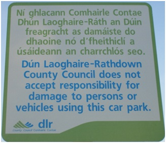

### Step 1: Perform Mean Shift Segmentation on the Image.

The program is concerned with finding text on notices. Text on notices is usually in block colours rather than gradients, so it is beneficial to group together nearby pixels of the image that have similar values into segments as characters will remain together while noise from non-character components of the image can be lessened.

Mean-shift segmentation is
<
TODO describe what mean shift segmentation is here.
Include what the parameters are, and how they are made to be generally good over all the images of notices
Why the image below looks the way it does, and why that's a good thing
>

**Result of mean-shift-segmentation:**  
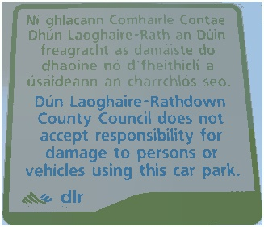

### Step 2: Convert the image to Grayscale

Once the mean-shift-segmentation has been performed, we convert the image to grayscale.
That is, for every pixel, we take the values in its 3 channels in e.g. RGB and convert them to one channel using this equation:  
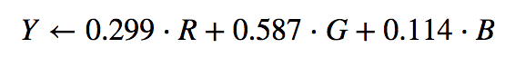

**Image converted to grayscale:**  
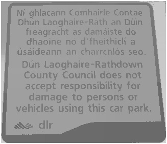

### Step 3: Convert the image to Binary

The difference in the brightness of text and notice backgrounds is generally very high to make the characters easier to read. This means that when the image is converted into binary, the text and notice backgrounds are extremely likely to be separated to black and white or white and black respectively.

The program creates the binary image by setting all pixels in the grayscale image with a value above the threshold to 255 and every pixel less than or equal to the threshold to 0. The threshold is determined using Otsu's method. Binary thresholding separates the pixels in a grayscale image into two classes, and Otsu's method finds the threshold that minimises the weighted sum of the variance of pixel values within the two classes. Otsu's method finds what the variance is in both classes for every single possible threshold, then does a weighted sum (the weights come from the probability of the a pixel being in either class) to find what the variance in both classes is for that threshold. The threshold that gives the minimum intra-class variance is used to create the binary image.

**Grayscale image converted to binary:**  
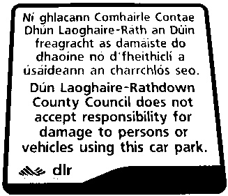

### Step 4: Connected Components Analysis

Next, the program performs connected components analysis on the binary image in order to find the points of each component in the image. Some of these components will be characters in the text from the notices.

The algorithm for connected components involves:
1. Stepping through the pixels, and:
  * If their value is not zero, and their previous neighbours are: assign them a new label to note that they are part of a new component.
  * If their value is not zero and neither are their previous neighbours: assign them the same label as their neighbours to note that they are part of the same component. *(If some of their previous neighbours have different labels, join them up to have the same label)*  
2. Passing over the image once more to set labels of components that are connected to have the same label value.

Once connected components analysis has been performed on the image, there is a record of the points that are contained in every component.

**Each component in the image flood filled to a different colour, to show that the components have been found:**  
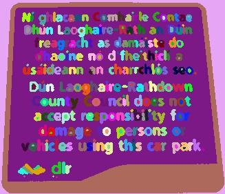

The process used up to this point is not perfect, and already some text may be lost from the image. If the difference between characters and the background of the notices is not clear, then the components that represent text might have more points than they should. This can lead to them not being classified as text later in the program.
Below is an example from the test images, that showcases how components might contain more pixels than just the associated character of text. In this example, the output text region still contains all of the text but is higher than the text region in the ground truth for the image, causing the DICE coefficient for the image to be .92. 

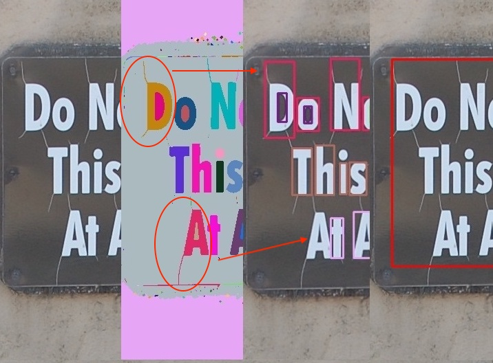

### 5: Getting the Average Colour of each component

Now that the program has the points for every component in the image, it creates an object to represent each component. Each object has the bounding rectangle of the component and the average pixel value of its points in the original image.  
The program does not need the points of the components from here on. The bouncing rectangles and the average colours of the components are enough for the process the program uses to to determine whether they are text.

To get the average colour of a component, a mask is made using the component's points to find only the pixels inside that component from the original image. To get the average colour of the component's pixel values, the average pixel value for each of its channels is computed and used for that channel.

**An example mask of a component from the image:**  
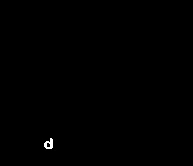

### 6: Finding Lines of Text

Lines of text are made up of at least two characters. Therefore the program looks at each segment it has found and, if it is sufficiently similar to another segment that is located nearby horizontally in the image, considers it a letter. The program assumes that the notices in an input image are upright enough that at least one pixel of each character in a line of text is on the same horizontal line in the image as one pixel of any adjacent characters in the line of text.

The criteria for two segments being part of a line of text together are:
* Both segments are within a certain distance (relative to their width) of each other horizontally.
* At least one pixel of the first segment is on the same horizontal line as at least one pixel in the second segment.
* The ratio of their bounding rectangle’s widths is above a threshold.
* The ratio of their bounding rectangle’s heights is above a threshold.
* The euclidean difference between the segments’ average pixel value is below a certain threshold.

The program creates a graph of nodes that represent all the segments. Every segment is compared to every other segment. If two segments are deemed to be part of the same line of text, an edge is drawn from one node to the other.

After this process, nodes that are connected represent lines of text.

Here is an example of what the outcome of this process is. Connected nodes are shown in the same colour.

**A representation of lines of text having been found in an image:**
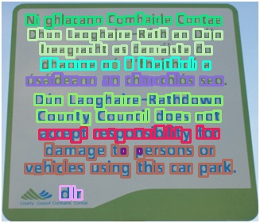

As seen in the above image, this process is not perfect.  

The inside of two characters have been determined to be text. Fortunately, for the purpose of the problem this does not have an effect on finding the rectangle surrounding a text region on notices within an image.  

Another problem that can be seen in the above image is that the dots of 'i' characters and '.' characters are not similar enough to their adjacent letters in size to be counted as text. This is a weakness of the solution, and is the reason that the test images fall from an average DICE coefficient of 1 to around .97 on the first and fourth test image when compared to the ground truths accompanying this report.

This process also finds segments that fit these criteria that are not text. This is the cause of the average DICE coefficient of the sixth and eight test images to be around .95 when compared to the ground truths accompanying this report. This can be seen in the image below:  
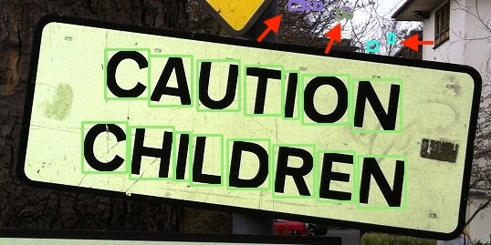
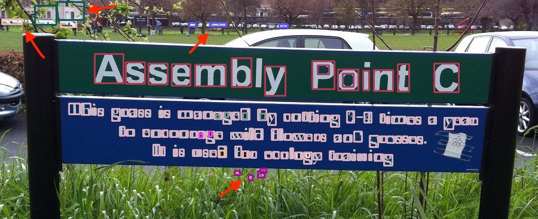

The problem of segments being incorrectly determined to be lines of text could be reduced by specifying that text regions must be a certain size, but that would not completely eliminate the issue.  
The program does not make sure that regions of text are of a certain size. This is so that text regions of any size can be identified.

### 7: Finding regions of text

The program determines whether two lines of text are in the same segment in a similar way to how it determines whether two segments are parts of the same line of text.

This is the criteria for a character of a line of text to be '*in the same text region*' as a character from another line of text:
* Both segments are within a certain distance (relative to their **height**) of each other **vertically**.
* At least one pixel of the first segment is on the same **vertical** line as at least one pixel in the second segment.
* The ratio of their bounding rectangle’s widths is above a threshold.
* The ratio of their bounding rectangle’s heights is above a threshold.
* The euclidean difference between the segments’ average pixel value is below a certain threshold.

If any character from a line of text is deemed to be '*in the same region*' as a character from another line of text, then the two lines of text are considered to be in the same text region.

**Regions of text represented with their characters displayed in the same colour:**  
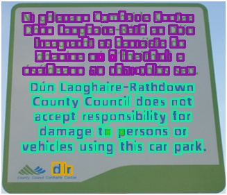

## Results

An average DICE coefficient was calculated for each test image with the equation:  
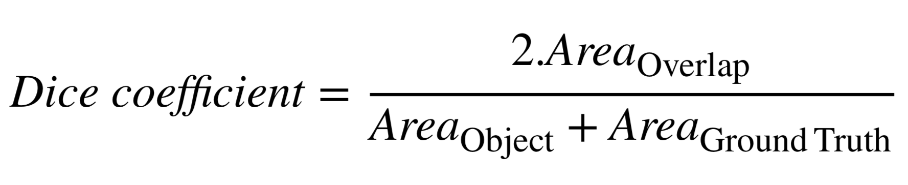

Here are the average DICE coefficients for test each image (the text regions found by the program are on the left):  

---

'Notice 1' Average DICE Coefficient: **0.979922**  
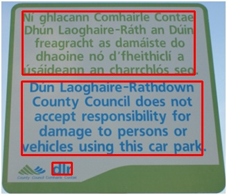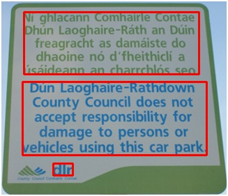

---

'Notice 2' Average DICE Coefficient: **0.978567**  
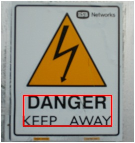

---

'Notice 3' Average DICE Coefficient: **0.929020**  
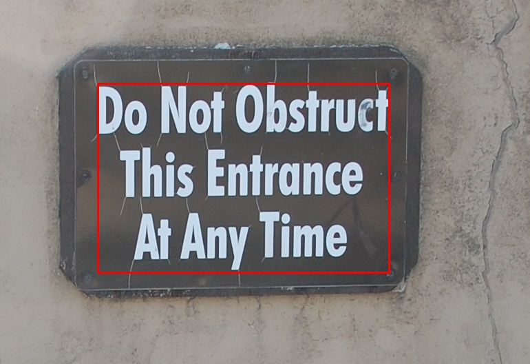

---

'Notice 4' Average DICE Coefficient: **0.984273**  
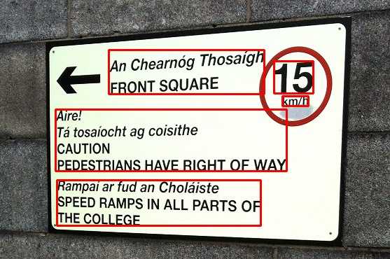

---

'Notice 5' Average DICE Coefficient: **0.965611**  
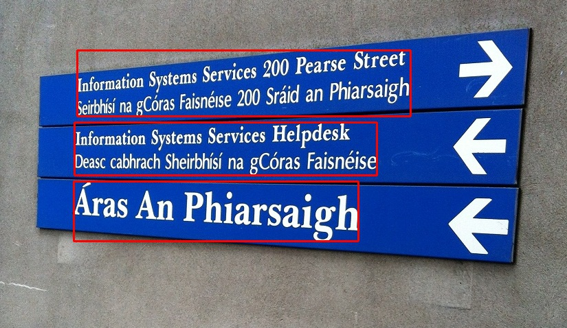

---

'Notice 6' Average DICE Coefficient: **0.941424**  
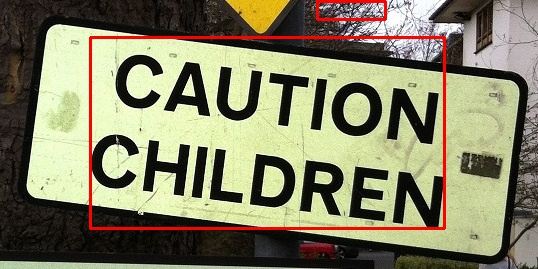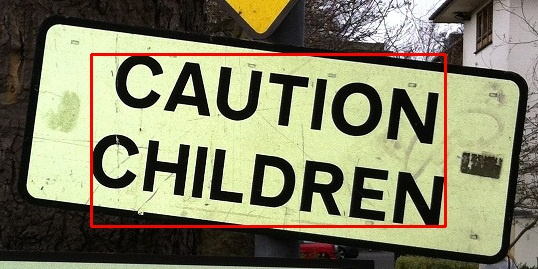

---

'Notice 7' Average DICE Coefficient: **0.941101**  
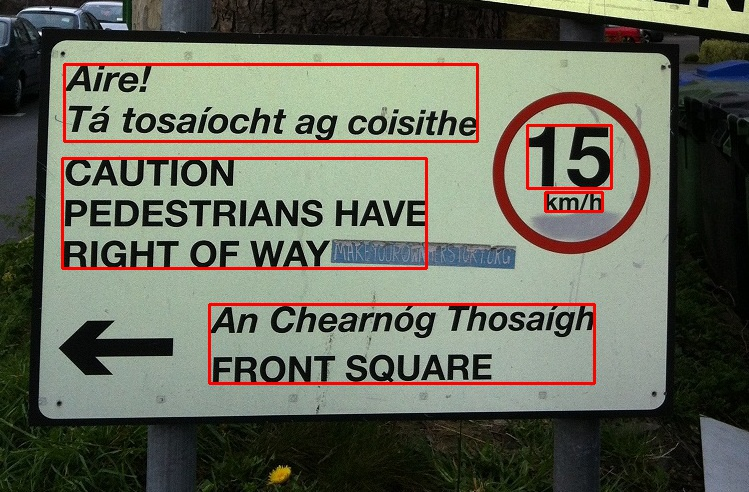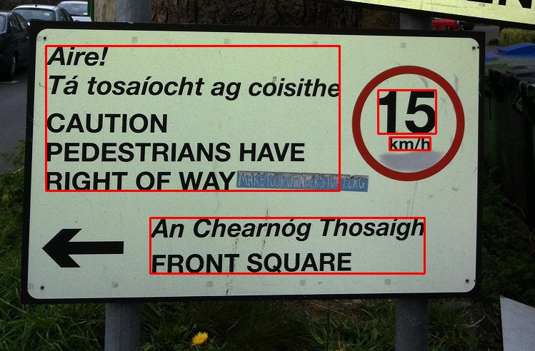

---

'Notice 8' Average DICE Coefficient: **0.956966**  
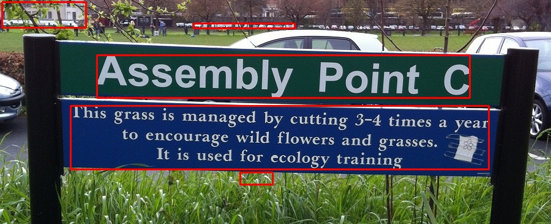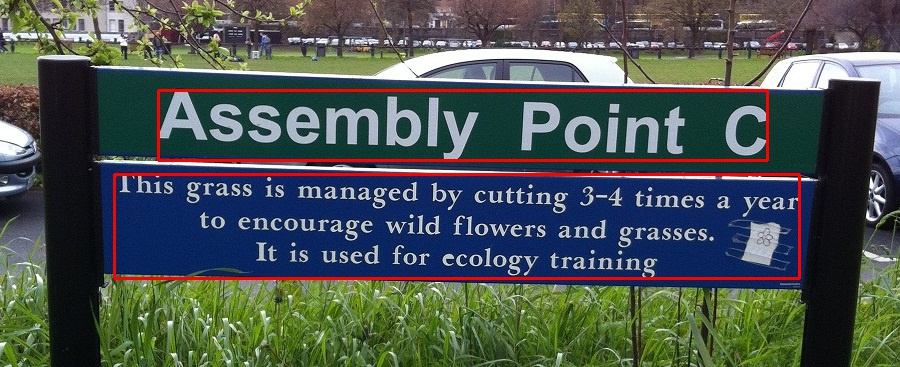

---

Average DICE coefficient across all 8 test images: **0.959611**.

## Discussion of Results

A casual observer might think that the program was more successful in determining regions of text in 'Notice 3' than 'Notice 8', but the average DICE coefficient of each image does not reflect this. This particular example is because the program thinks characters in 'Notice 3' are higher than they really are, and has misinterpreted components of 'Notice 8' as text. Perhaps misinterpreting components as text should be penalised more than classifying characters as containing more points if a different metric was to be used in calculating the accuracy of the program.  
A better metric might make use of how many pixels of characters are successfully/incorrectly classified as text/not-text in the image, but finding the exact pixels of the text rather than the regions that contain the text is a different problem.

Another example of how the average DICE coefficients may give the wrong impression of how well the solution did is on 'Notice 5' where the only piece of text that was not correctly categorised was the fada of the 'Á' in the last text region, however this leads to the height of the ground truth to be increased all the way across the wide text region. This also happens on 'Notice 1' where the '.' characters (that are missing from the program's detected text regions) increase the width of two entire ground truths. Missing characters like fadas or full stops can disproportionately increase the difference between the observations and the ground truths.

Another observation of the ground truths is that the ground truth for 'Notice 7' has decided to classify an area with lines of text as one text region where as the program has decided to classify it as two text regions. This causes the average DICE coefficient for the image to be 0.956966. Different people could be of the opinion that the program has correctly interpreted the below text as two regions instead of one.  
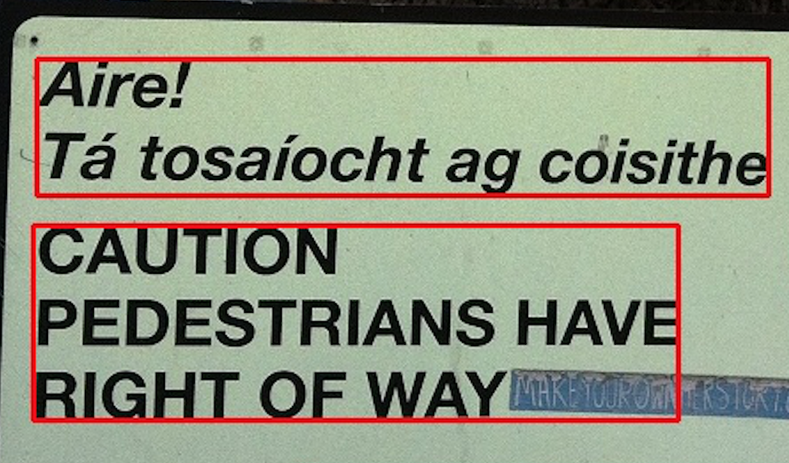

## Closing Notes for Improvement

The program is not 100% accurate, and that can be seen not only in the average DICE coefficients for the test images when comparing them to the ground truths, but is clear when reviewing the regions of the images that the program has determined to be text. The program could be made better by improving the process in which it gets its segments of the image, and by improving the process by which it deems segments to be text.  
Among other processes the option of using mathematical morphology to get rid of noise around characters was explored, but did not make it to the final iteration of the program's design, as tested parameters for different operations did not produce an improvement for any test image without producing a deterioration in another.  
The way in which the program determines whether segments are part of the same text is also rudimentary, and could be improved maybe by incorporating stroke width into the comparison of the segments.

The program also makes the assumption that the notices in the images are reasonably upright so that adjacent characters in a line of text will contain at least one pixel each that lay on the same horizontal line within the image. Were the program not to make this assumption, it could also locate text regions on sideways notices in images.
